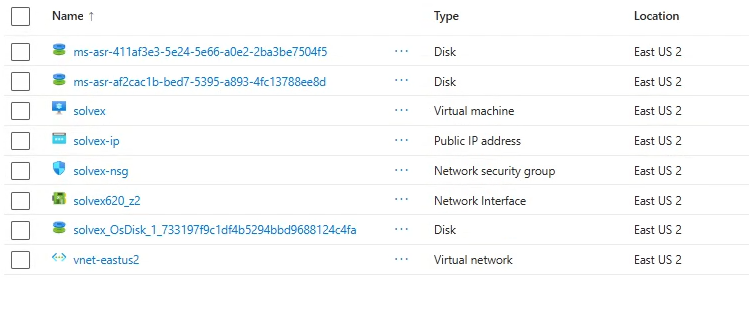
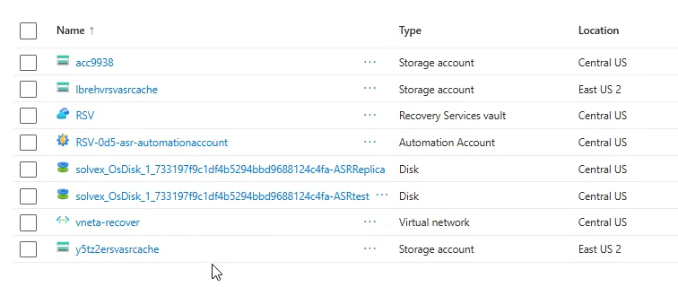
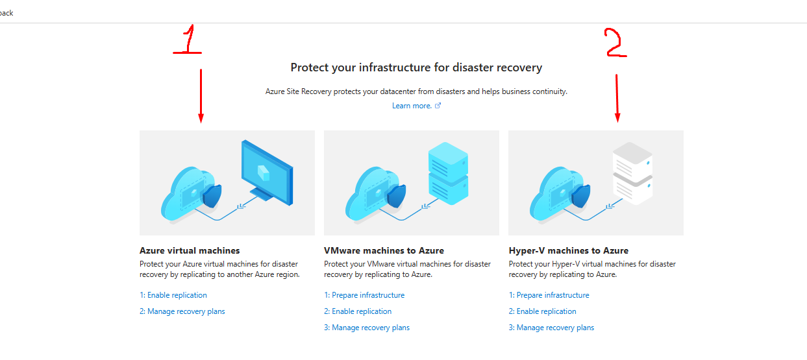
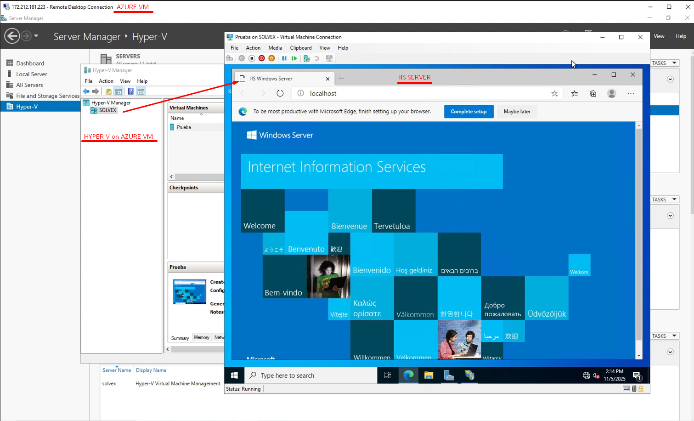

# Overview
In this project, I implemented a Disaster Recovery solution using Azure Site Recovery, a Microsoft Azure service that enables business continuity by replicating workloads across Azure regions. I configured virtual machine replication, defined recovery policies, and validated the solution through failover testing, ensuring service availability and minimizing downtime in the event of a disaster.

# Resource Group
To carry out the Disaster Recovery implementation in Azure, I used a Resource Group that included a virtual machine, managed disks, a public IP address, a Network Security Group, a network interface, and a virtual network, all deployed in the East US 2 region, which were required to enable and validate replication and recovery using Azure Site Recovery.

## Secondary Region Setup for Azure Site Recovery
The next step was to create a secondary Resource Group where the server would be replicated and recovered in the event of a disaster. This prior configuration is critical to ensure that the recovery environment is ready and that failover can be executed quickly without manual intervention.

In this Resource Group, most resources are deployed in Central US as the target recovery region, while two Storage Accounts remain in East US 2 because they must be linked with the source environment first in order to replicate and synchronize the required metadata before enabling full replication with Azure Site Recovery.

# Which one to select?
I wanted to take the time to properly explain this topic because, for me, it was one of the most difficult and challenging parts to understand during the implementation. I spent several days analyzing how Azure replication works and determining the best option, since there are multiple alternatives available, as shown in the image. In this section, I will only explain option number 1 and option number 2, as they are the most relevant for on-premise environments and home labs.

Before getting started, it is essential to clearly understand how metadata works in Azure and how it enables regional replication or availability zone replication. Metadata is used by Azure Site Recovery to coordinate replication and failover operations and must remain within the geographic region of your Recovery Services vault.

If you are not familiar with this concept, I recommend reviewing the official documentation first: https://learn.microsoft.com/en-us/azure/site-recovery/site-recovery-faq#does-site-recovery-send-my-replication-data-to-the-service

 **Option 1 (Azure Virtual Machine):**
This option is mainly intended for home labs or testing environments, meaning scenarios where you are working with a virtual machine created directly in Azure. As the name suggests, Azure Virtual Machine instructs Azure to replicate its own resources within its cloud infrastructure, which greatly simplifies the implementation and only requires the configurations previously mentioned at the beginning of this guide.

**Option 2 (Hyper-V Machines to Azure):**
This option is used in on-premise environments, specifically when you have a local physical server hosting virtual machines and internal services. In scenarios where you need to protect both the physical server and the virtual machines running inside it (commonly known as nested virtualization), this is the correct option.

**Option 2:** works by installing an agent provided by Azure, which must be downloaded and installed on the physical server. This agent is then linked to Azure using a unique and secure key generated by the service. Once the connection is established, the replication of the local server to Azure begins, a process commonly referred to as On-Premise replication.

# Which one did I choose?

In my case, I chose option number 1, using a virtual machine created directly in Azure. On this VM, I enabled the Hyper-V feature to create a nested virtualized environment within the cloud, and inside that nested VM, I installed an IIS (Internet Information Services) server to simulate a web server. This allowed me to configure replication and redundancy for the service, ensuring high availability and resilience against potential failures, demonstrating how Azure Site Recovery can protect both cloud-based virtual infrastructure and the critical applications running on it.

# Advantages
